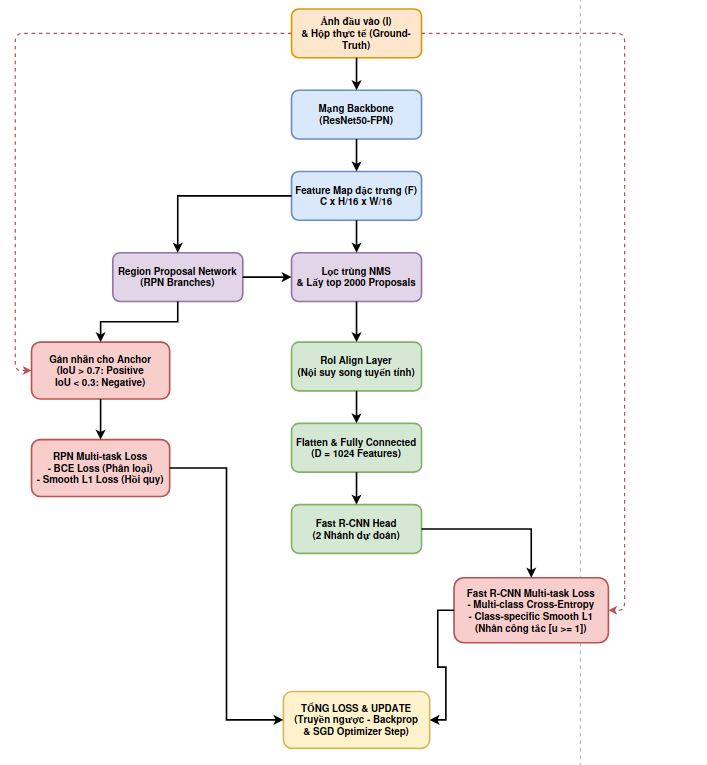
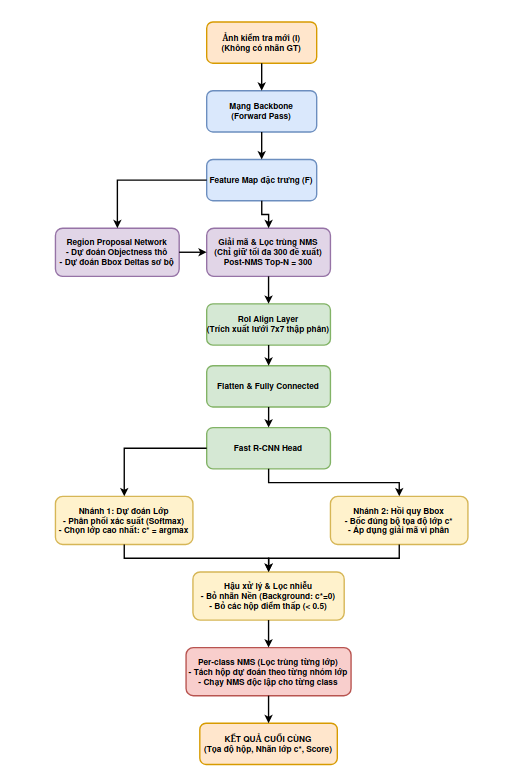
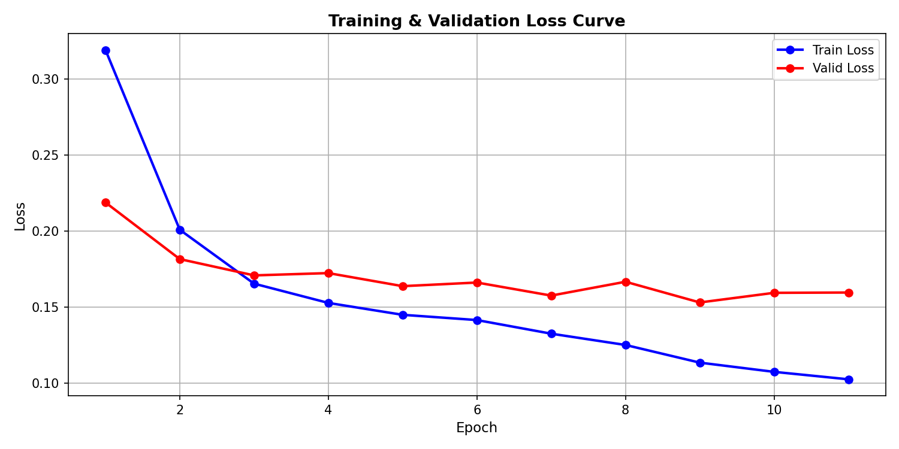
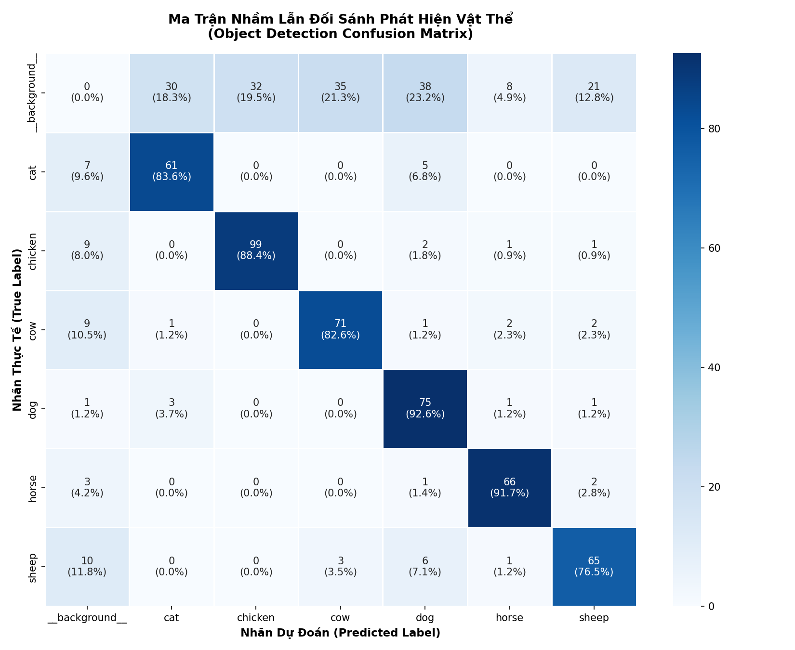
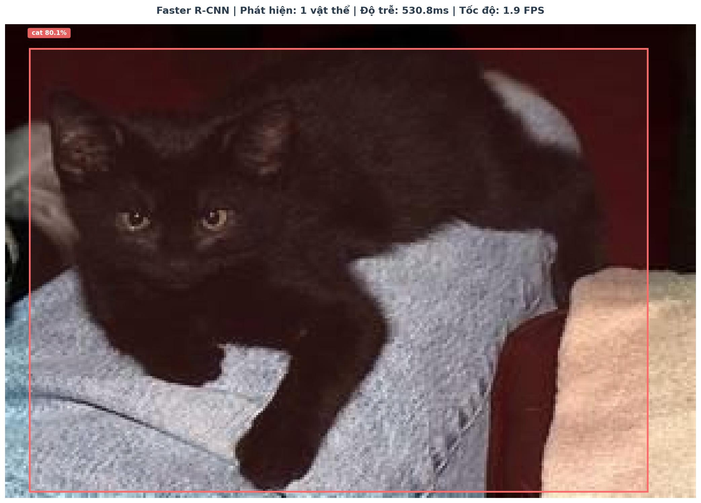
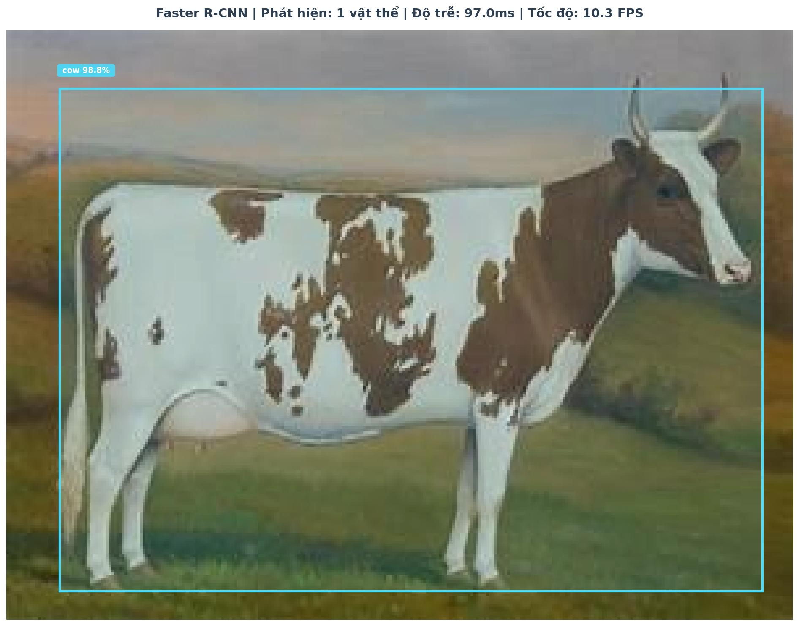
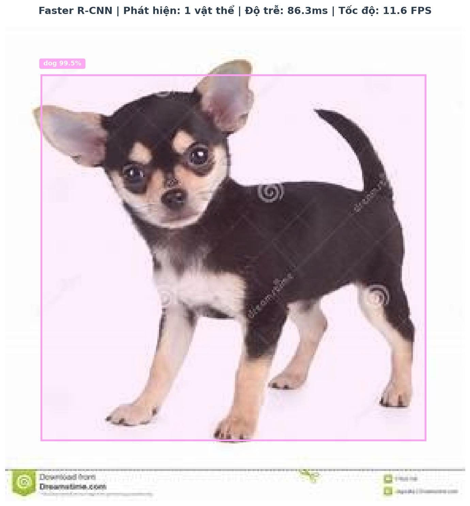
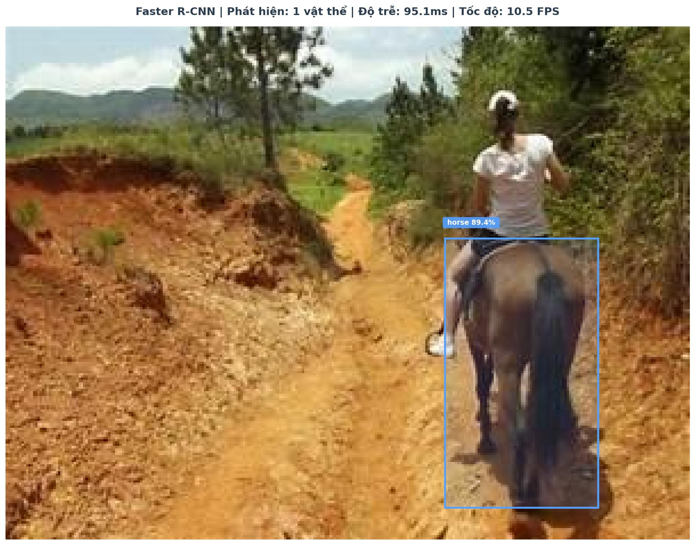
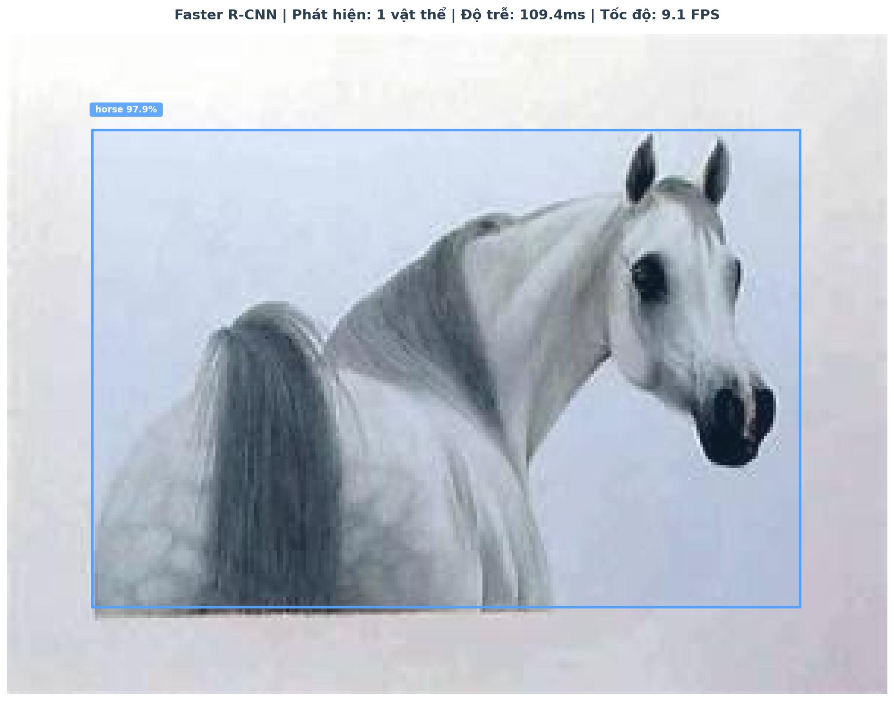

# SIÊU BÁO CÁO CHI TIẾT ĐỒ ÁN: NHẬN DIỆN VẬT THỂ ĐỘNG VẬT BẰNG KIẾN TRÚC FASTER R-CNN

---

## 1. GIỚI THIỆU ĐỀ TÀI & BỐI CẢNH BÀI TOÁN

Nhận diện vật thể (Object Detection) là một trong những bài toán cốt lõi và phức tạp nhất của lĩnh vực Thị giác máy tính (Computer Vision). Không chỉ dừng lại ở việc phân loại hình ảnh (Image Classification) để trả lời câu hỏi "Trong ảnh có gì?", nhận diện vật thể còn đòi hỏi mô hình phải xác định chính xác vị trí của từng đối tượng thông qua các hộp bao quanh (Bounding Boxes) - tức là giải quyết bài toán định vị (Localization).

Đồ án này tập trung nghiên cứu, huấn luyện và đánh giá thực nghiệm mô hình **Faster R-CNN** – một kiến trúc nhận diện vật thể hai giai đoạn (two-stage detector) kinh điển và vô cùng mạnh mẽ. Bài toán cụ thể được giải quyết là nhận diện **6 nhóm động vật nuôi phổ biến**:
*   `cat` (mèo)
*   `chicken` (gá)
*   `cow` (bò)
*   `dog` (chó)
*   `horse` (ngựa)
*   `sheep` (cừu)

Bộ dữ liệu được sử dụng là **Animals v1**, một tập dữ liệu thực tế với độ đa dạng cao về góc chụp, điều kiện ánh sáng, sự che khuất và kích thước vật thể, mang lại độ thử thách lớn cho mô hình học sâu.

---

## 2. CƠ SỞ LÝ THUYẾT CHUYÊN SÂU KIẾN TRÚC FASTER R-CNN

Kiến trúc Faster R-CNN là sự đột phá vượt bậc khi tích hợp trực tiếp mạng đề xuất vùng ứng viên (**Region Proposal Network - RPN**) vào cùng một kiến trúc chia sẻ đặc trưng với mạng phân loại (**Fast R-CNN**). Dưới đây là phân tích chi tiết dòng toán học và dòng dữ liệu ở cả hai pha: **Huấn luyện (Training)** và **Suy luận (Inference)**.

---

### 2.1. Phân Tích Toán Học Chuyên Sâu - Quá Trình Huấn Luyện (Training Pipeline)

Trong quá trình huấn luyện, mục tiêu tối cao của Faster R-CNN là tối ưu hóa tập hợp trọng số của toàn bộ mô hình (bao gồm Backbone, RPN và Fast R-CNN Head) thông qua phương pháp truyền ngược (Backpropagation) dựa trên các nhãn Ground-truth thực tế.

Dưới đây là sơ đồ dòng dữ liệu toán học chi tiết trong quá trình huấn luyện:



#### A. Backbone & Feature Extraction
Đầu vào là bức ảnh có kích thước thực tế:
$$I \in \mathbb{R}^{3 \times H_0 \times W_0}$$

Bức ảnh đi qua mạng CNN Backbone (ở đây là **ResNet-50 FPN** đã được huấn luyện trước trên tập MS COCO) để trích xuất Feature Map đặc trưng ở cấp độ cao:
$$F = \Phi_{\text{backbone}}(I, \theta_{\text{backbone}})$$
*   **Sản phẩm (Output):** Feature Map $F \in \mathbb{R}^{C \times H \times W}$ với $H = \frac{H_0}{S}, W = \frac{W_0}{S}$ ($S$ là stride thu nhỏ không gian của mạng, thông thường $S=16$ đối với mạng trích xuất cơ bản).

#### B. Region Proposal Network (RPN)
Mục tiêu của RPN trong quá trình huấn luyện là học cách sinh ra các đề xuất vùng chứa vật thể chất lượng cao bằng cách tối ưu hóa đồng thời hai nhánh: phân loại đối tượng (Objectness) và tinh chỉnh vị trí hộp neo (Anchor).

##### 1. Sinh Anchor giả định
Tại mỗi tọa độ không gian $(i, j)$ trên Feature Map $F$, ta đặt $k=9$ Anchor boxes tĩnh đại diện cho 3 tỷ lệ khung hình (Aspect Ratios: $1:1, 1:2, 2:1$) và 3 kích cỡ (Scales: $128^2, 256^2, 512^2$ pixel). Tổng số anchor trên toàn bộ bức ảnh là:
$$N = H \times W \times k$$
Mỗi anchor $n$ ($1 \le n \le N$) được biểu diễn bằng tọa độ tĩnh ban đầu: $\mathbf{a}_n = (x_a, y_a, w_a, h_a)$.

##### 2. Nhánh Phân loại & Hồi quy RPN
*   **Nhánh phân loại (Classification Branch):** Dự đoán xác suất anchor là vật thể (Foreground) hay nền (Background) bằng hàm Softmax nhị phân:
    $$\mathbf{p}_n = (p_{\text{bg}}, p_{\text{fg}}) = \left( \frac{\exp(z_{\text{bg}})}{\exp(z_{\text{bg}}) + \exp(z_{\text{fg}})}, \frac{\exp(z_{\text{fg}})}{\exp(z_{\text{bg}}) + \exp(z_{\text{fg}})} \right)$$
*   **Nhánh hồi quy (Regression Branch):** Dự đoán vector tinh chỉnh tọa độ $\mathbf{t}_n = (t_x, t_y, t_w, t_h)$ để biến đổi anchor tĩnh $\mathbf{a}_n$ thành hộp đề xuất $\mathbf{p}_n = (x, y, w, h)$ thông qua:
    $$x = x_a + t_x \cdot w_a, \quad y = y_a + t_y \cdot h_a$$
    $$w = w_a \cdot \exp(t_w), \quad h = h_a \cdot \exp(t_h)$$

##### 3. Quá trình Gán Nhãn (Label Assignment) cho Anchor
Để tính toán Loss cho RPN, ta cần so sánh các anchor dự đoán với Ground-truth (hộp thực tế). Thuật toán đo chỉ số **IoU (Intersection over Union)** giữa hàng vạn anchor box và các hộp Ground-truth thực tế, sau đó gán nhãn mục tiêu ($p_i^*$) theo quy tắc:
*   **Positive (Foreground, $p_i^* = 1$):** Các anchor có $\text{IoU} > 0.7$ với bất kỳ Ground-truth nào, HOẶC là anchor có IoU cao nhất với một Ground-truth cụ thể.
*   **Negative (Background, $p_i^* = 0$):** Các anchor có $\text{IoU} < 0.3$ với toàn bộ các Ground-truth.
*   **Bỏ qua (Don't care):** Các anchor có IoU nằm trong khoảng $[0.3, 0.7]$. Chúng bị loại bỏ, không tham gia vào quá trình tính loss để tránh làm nhiễu mô hình.

##### 4. Hàm mất mát RPN Multi-task Loss
Thay vì tính Loss trên toàn bộ hàng vạn anchor (gây quá tải tính toán và mất cân bằng nghiêm trọng vì đa số anchor là nền), RPN lấy mẫu ngẫu nhiên một **mini-batch** $N_{\text{cls}} = 256$ anchors từ khắp bức ảnh (duy trì tỷ lệ lý tưởng Foreground:Background là $1:1$ hay $128:128$).

Hàm mất mát tổng hợp của RPN trên mini-batch được định nghĩa là:
$$\mathcal{L}_{\text{RPN}}(\{p_i\}, \{t_i\}) = \frac{1}{N_{\text{cls}}} \sum_{i} \mathcal{L}_{\text{cls}}(p_i, p_i^*) + \lambda \frac{1}{N_{\text{reg}}} \sum_{i} p_i^* \mathcal{L}_{\text{reg}}(t_i, t_i^*)$$

*   **Mất mát phân loại ($\mathcal{L}_{\text{cls}}$) - Binary Cross-Entropy Loss (BCE):**
    $$\mathcal{L}_{\text{cls}}(p_i, p_i^*) = -\left[ p_i^* \log(p_i) + (1 - p_i^*) \log(1 - p_i) \right]$$
    Với $p_i$ là xác suất dự đoán anchor $i$ chứa vật thể và $p_i^*$ là nhãn thực tế ($1$ hoặc $0$).
*   **Mất mát hồi quy ($\mathcal{L}_{\text{reg}}$) - Smooth $L_1$ Loss:**
    Chỉ được tính khi anchor thực sự chứa vật thể ($p_i^* = 1$). Nếu là nền ($p_i^* = 0$), loss hồi quy bằng 0.
    $$\mathcal{L}_{\text{reg}}(t_i, t_i^*) = \sum_{j \in \{x,y,w,h\}} \text{smooth}_{L_1}(t_{i,j} - t_{i,j}^*)$$
    Trong đó $t_{i,j}^*$ là mục tiêu dịch chuyển thực tế từ anchor đến Ground-truth:
    $$t_x^* = \frac{x^* - x_a}{w_a}, \quad t_y^* = \frac{y^* - y_a}{h_a}, \quad t_w^* = \ln\left(\frac{w^*}{w_a}\right), \quad t_h^* = \ln\left(\frac{h^*}{h_a}\right)$$
    Cơ chế hàm **Smooth $L_1$** với sai số $d = t_{i,j} - t_{i,j}^*$:
    $$\text{smooth}_{L_1}(d) = \begin{cases} 0.5 d^2 & \text{nếu } |d| < 1 \\ |d| - 0.5 & \text{ngược lại} \end{cases}$$
    *   **Khi sai số nhỏ ($|d| < 1$):** Hàm bậc hai ($0.5 d^2$) có độ dốc giảm dần về 0 khi tiệm cận điểm cực trị, giúp mô hình hội tụ cực kỳ êm ái và chính xác mà không bị dao động mạnh.
    *   **Khi sai số lớn ($|d| \ge 1$):** Hàm bậc nhất ($|d| - 0.5$) có đạo hàm không đổi (bằng hằng số $\pm 1$), ngăn chặn hiện tượng bùng nổ gradient (exploding gradient) khi mô hình dự đoán sai lệch lớn ở các epoch đầu.

##### 5. Lọc NMS cho đề xuất huấn luyện
Sau khi có các hộp đề xuất đã dịch chuyển, RPN thực hiện lọc Non-Maximum Suppression (NMS) với ngưỡng IoU $\ge 0.7$ dựa trên điểm Objectness $p_{\text{fg}}$.
*   Trong quá trình **Huấn luyện**, RPN giữ lại tối đa **2000 hộp đề xuất tốt nhất** (Post-NMS Top-N = 2000), ký hiệu là $\mathbf{B}_{RPN}$. Lượng đề xuất dồi dào này giúp mạng Fast R-CNN phía sau có đủ dữ liệu đa dạng để học cách phân loại và tinh chỉnh hộp bao chính xác.

#### C. RoI Align (Căn chỉnh vùng quan tâm)
Các hộp đề xuất $\mathbf{B}_{RPN}$ có tọa độ số thực (thập phân) được ánh xạ trực tiếp lên Feature Map $F$. Để tránh việc làm tròn số nguyên (gây sai lệch thông tin không gian - hiện tượng Misalignment nghiêm trọng đối với vật thể nhỏ), thuật toán áp dụng **RoI Align**:
1.  Chia vùng đề xuất thành một lưới cố định kích thước $7 \times 7$ ô.
2.  Trong mỗi ô lưới, thiết lập 4 điểm lấy mẫu lơ lửng (tọa độ số thực).
3.  Áp dụng phép toán **Nội suy song tuyến tính (Bilinear Interpolation)** để tính toán giá trị đặc trưng cho các điểm lơ lửng này từ 4 pixel nguyên bao quanh trên Feature Map:
    $$f(x,y) = \sum_{i=1}^2 \sum_{j=1}^2 w_{i,j} \cdot F(x_i, y_j)$$
4.  Tiến hành thực hiện Max Pooling trên 4 điểm lấy mẫu trong mỗi ô lưới để xuất ra Tensor đặc trưng chuẩn hóa đồng dạng:
    $$\mathbf{R}_m \in \mathbb{R}^{C \times 7 \times 7} \quad (\text{với mỗi RoI } m = 1, \dots, 2000)$$

#### D. Fast R-CNN Head
##### 1. Các lớp liên kết đầy đủ (FC Layers)
Tensor đặc trưng $\mathbf{R}_m$ được duỗi thẳng (flatten) thành vector và đi qua các lớp Fully Connected để tạo ra vector đặc trưng sâu:
$$\mathbf{f}_m = \sigma(\mathbf{W}_{FC} \cdot \text{flatten}(\mathbf{R}_m) + \mathbf{b}_{FC})$$

##### 2. Hai nhánh dự đoán song song
*   **Phân loại lớp (Classification Branch):** Dự đoán vector logits $\mathbf{z} \in \mathbb{R}^{K+1}$ ($K$ lớp đối tượng + 1 lớp nền). Áp dụng hàm Softmax để thu được phân bố xác suất dự đoán của hộp đề xuất trên $K+1$ lớp:
    $$\hat{p}_i = \frac{\exp(z_i)}{\sum_{j=0}^{K} \exp(z_j)} \quad \text{cho } i = 0, 1, ..., K$$
*   **Hồi quy tinh chỉnh (Regression Branch):** Mạng học và dự đoán ma trận đầu ra $\mathbf{V} \in \mathbb{R}^{(K+1) \times 4}$. Với mỗi lớp đối tượng giả định $c \in \{0, 1, ..., K\}$, ta thu được một bộ 4 tham số tinh chỉnh vị trí $\mathbf{v}_c = (v_{cx}, v_{cy}, v_{cw}, v_{ch})$ riêng biệt (Class-specific Regression).

##### 3. Hàm mất mát Fast R-CNN Multi-task Loss
Hàm mất mát tổng của Fast R-CNN Head được tính trên các RoI được lấy mẫu:
$$\mathcal{L}_{\text{head}}(p, u, t^u, v) = \mathcal{L}_{\text{cls}}(p, u) + \lambda \cdot [u \ge 1] \cdot \mathcal{L}_{\text{reg}}(t^u, v)$$

*   **Mất mát phân loại đa lớp ($\mathcal{L}_{\text{cls}}$) - Multi-class Cross-Entropy Loss:**
    $$\mathcal{L}_{\text{cls}}(p, u) = -\ln(p_u)$$
    Trong đó $p_u$ là xác suất mô hình dự đoán trúng lớp thực tế $u$ ($u = 0$ đại diện cho nền).
*   **Mất mát hồi quy tinh chỉnh ($\mathcal{L}_{\text{reg}}$) - Class-specific Smooth $L_1$ Loss:**
    $$\mathcal{L}_{\text{reg}}(t^u, v) = \sum_{j \in \{x,y,w,h\}} \text{smooth}_{L_1}(t_j^u - v_j)$$
    Với $v$ là vector mục tiêu thực tế (độ lệch thực sự giữa hộp đề xuất $\mathbf{B}_{RPN}$ và Ground-truth) và $t^u$ là vector 4 thông số nắn chỉnh do mô hình dự đoán, **rút ra từ hàng thứ $u$** tương ứng nhãn thật của vật thể trong ma trận $\mathbf{V}$. Các hàng còn lại bị phớt lờ hoàn toàn.
*   **Hàm chỉ thị $[u \ge 1]$ (Công tắc toán học):**
    *   Nếu RoI chứa vật thể thực sự ($u \ge 1$): công tắc bằng 1, kích hoạt tính toán loss hồi quy.
    *   Nếu RoI rơi vào nền ($u = 0$): công tắc bằng 0, loss hồi quy triệt tiêu hoàn toàn vì vùng nền không có tọa độ mục tiêu để nắn chỉnh.

---

### 2.2. Phân Tích Toán Học Chuyên Sâu - Quá Trình Suy Luận (Inference Pipeline)

Trong quá trình suy luận (Inference/Evaluation), mục tiêu của Faster R-CNN là xử lý một bức ảnh mới hoàn toàn (không có nhãn Ground-truth) và xuất ra danh sách các vật thể được nhận diện cùng hộp giới hạn (Bounding box) tối ưu và độ tin cậy tương ứng. 

Quá trình suy luận hoạt động hoàn toàn ở chế độ lan truyền xuôi (Forward Pass), không tính toán hàm mất mát hay truyền ngược để tối ưu hóa trọng số.

Dưới đây là sơ đồ dòng dữ liệu toán học chi tiết trong quá trình suy luận:



#### A. Backbone (Trích xuất đặc trưng)
Đầu vào là bức ảnh cần nhận diện:
$$I \in \mathbb{R}^{3 \times H_0 \times W_0}$$

Bức ảnh đi qua mạng CNN Backbone để trích xuất Feature Map đặc trưng ở cấp độ cao:
$$F = \Phi_{\text{backbone}}(I)$$
*   **Sản phẩm (Output):** Feature Map $F \in \mathbb{R}^{C \times H \times W}$ với $H = \frac{H_0}{S}, W = \frac{W_0}{S}$ ($S$ là stride thu nhỏ không gian, thường $S=16$).

#### B. Region Proposal Network (RPN)
##### 1. Sinh Anchor giả định
Tại mỗi tọa độ không gian $(i, j)$ trên Feature Map $F$, ta đặt $k=9$ Anchor boxes tĩnh đại diện cho các scale và aspect ratio khác nhau:
$$\mathbf{a}_n = (x_a, y_a, w_a, h_a) \quad \text{với } n = 1, \dots, H \times W \times k$$

##### 2. Dự đoán nhị phân & Tinh chỉnh sơ bộ RPN
Feature Map $F$ đi qua các lớp tích chập của RPN để tạo ra hai nhánh kết quả:
*   **Nhánh phân loại (Classification Branch):** Dự đoán xác suất chứa vật thể (Objectness Score) cho mỗi anchor. Giá trị xác suất chứa vật thể của anchor $n$ là:
    $$p_{\text{fg}} = \frac{\exp(z_{\text{fg}})}{\exp(z_{\text{bg}}) + \exp(z_{\text{fg}})}$$
*   **Nhánh hồi quy (Bbox Regression Branch):** Dự đoán vector tinh chỉnh tọa độ $\mathbf{t}_n = (t_x, t_y, t_w, t_h)$ cho mỗi anchor.

##### 3. Giải mã tọa độ đề xuất (Proposal Decoding)
Sử dụng các giá trị dịch chuyển dự đoán $\mathbf{t}_n$ để biến đổi Anchor tĩnh $\mathbf{a}_n$ thành Hộp đề xuất thực tế $\mathbf{p}_n = (x, y, w, h)$ trên ảnh gốc:
$$x = x_a + t_x \cdot w_a, \quad y = y_a + t_y \cdot h_a$$
$$w = w_a \cdot \exp(t_w), \quad h = h_a \cdot \exp(t_h)$$

##### 4. Lọc NMS cho đề xuất suy luận (RPN Proposals Filtering)
Vì RPN sinh ra hàng vạn hộp đề xuất chồng chéo nhau, thuật toán cần tinh lọc để giảm thiểu gánh nặng tính toán cho phần sau:
1.  **Sắp xếp & Cắt tỉa thô:** Sắp xếp tất cả các hộp đề xuất theo thứ tự giảm dần của điểm số chứa vật thể $p_{\text{fg}}$. Chỉ giữ lại top $N$ hộp cao nhất (ví dụ: $6000$ hộp).
2.  **NMS cốt lõi:**
    *   Chọn hộp có điểm cao nhất làm hộp chuẩn.
    *   Loại bỏ các hộp còn lại có chỉ số trùng lặp **IoU $\ge 0.7$** so với hộp chuẩn.
    *   Lặp lại cho đến khi duyệt hết danh sách.
3.  **Cắt tỉa tinh (Post-NMS Top-N):**
    *   Trong quá trình **Suy luận (Inference)**, mô hình yêu cầu tốc độ và sự tinh gọn, nên RPN chỉ giữ lại tối đa **$300$ hộp đề xuất tốt nhất** (Post-NMS Top-N = 300), ký hiệu là $\mathbf{B}_{RPN}$. Con số này ít hơn nhiều so với 2000 hộp trong quá trình huấn luyện.

#### C. RoI Align (Căn chỉnh Vùng quan tâm)
Từng hộp trong danh sách $300$ đề xuất $\mathbf{B}_{RPN}$ (tọa độ số thập phân) được ánh xạ lên Feature Map $F$:
*   Chia vùng đề xuất thành lưới cố định $7 \times 7$ ô.
*   Trích xuất đặc trưng tại 4 điểm lấy mẫu trong mỗi ô bằng thuật toán **Nội suy song tuyến tính (Bilinear Interpolation)** từ các pixel lân cận của Feature Map:
    $$f(x,y) = \sum_{i=1}^2 \sum_{j=1}^2 w_{i,j} \cdot F(x_i, y_j)$$
*   Tiến hành Max Pooling trong mỗi ô lưới để thu về Tensor đặc trưng chuẩn hóa đồng dạng cho mọi đề xuất:
    $$\mathbf{R}_m \in \mathbb{R}^{C \times 7 \times 7} \quad (\text{cho mỗi hộp đề xuất } m = 1, \dots, 300)$$

#### D. Fast R-CNN Head - Nhánh nhận diện và tinh chỉnh cuối cùng
##### 1. Lớp liên kết đầy đủ (FC Layers)
Đuỗi thẳng Tensor đặc trưng $\mathbf{R}_m$ thành vector và cho đi qua các lớp Fully Connected để tạo ra đặc trưng sâu:
$$\mathbf{f}_m = \sigma(\mathbf{W}_{FC} \cdot \text{flatten}(\mathbf{R}_m) + \mathbf{b}_{FC})$$

##### 2. Hai nhánh dự đoán song song
*   **Phân loại lớp (Classification):** Tính toán vector logits $\mathbf{z} \in \mathbb{R}^{K+1}$ ($K$ lớp đối tượng + 1 lớp nền). Áp dụng hàm Softmax để thu được phân bố xác suất dự đoán của hộp đề xuất trên $K+1$ lớp:
    $$\hat{p}_i = \frac{\exp(z_i)}{\sum_{j=0}^{K} \exp(z_j)} \quad \text{cho } i = 0, 1, ..., K$$
*   **Hồi quy tinh chỉnh (Regression):** Mạng dự đoán ma trận đầu ra $\mathbf{V} \in \mathbb{R}^{(K+1) \times 4}$. Với mỗi lớp đối tượng giả định $c \in \{0, 1, ..., K\}$, ta thu được một bộ 4 tham số tinh chỉnh vị trí $\mathbf{v}_c = (v_{cx}, v_{cy}, v_{cw}, v_{ch})$ riêng biệt.

##### 3. Hậu xử lý kết quả & Xuất hộp giới hạn cuối cùng (Post-processing Pipeline)
Đây là quy trình tối quan trọng để chuyển đổi các dự đoán của mô hình thành kết quả trực quan cuối cùng:

*   **Bước 1: Xác định nhãn dự đoán ($c^*$) và Ngưỡng tin cậy (Confidence Threshold)**
    *   Đối với mỗi RoI $m$, xác định lớp dự đoán có xác suất cao nhất:
        $$c^* = \arg\max(\mathbf{\hat{p}})$$
    *   Chỉ số tin cậy tương ứng là: $\text{score} = \hat{p}_{c^*}$.
    *   Loại bỏ các đề xuất bị phân loại là nền ($c^* = 0$).
    *   Loại bỏ các đề xuất có độ tin cậy thấp hơn một ngưỡng tối thiểu (ở đây áp dụng $\text{score} < 0.5$).
*   **Bước 2: Áp dụng hồi quy tọa độ lớp chuyên biệt (Class-specific Bbox Decoding)**
    *   Lấy bộ thông số tinh chỉnh $\mathbf{v}_{c^*}$ ứng với duy nhất lớp dự đoán $c^*$ từ ma trận $\mathbf{V}$.
    *   Áp dụng $\mathbf{v}_{c^*}$ để biến đổi Hộp đề xuất RPN tương ứng $\mathbf{p}_m$ thành Hộp giới hạn cuối cùng $\mathbf{b}^* = (x^*, y^*, w^*, h^*)$ trên ảnh gốc:
        $$x^* = x_p + v_{c^* x} \cdot w_p, \quad y^* = y_p + v_{c^* y} \cdot h_p$$
        $$w^* = w_p \cdot \exp(v_{c^* w}), \quad h^* = h_p \cdot \exp(v_{c^* h})$$
*   **Bước 3: Lọc Non-Maximum Suppression theo từng lớp (Per-class NMS)**
    *   Tại bước này, ta vẫn thu được nhiều hộp dự đoán đè lên nhau cho cùng một vật thể (do các RoI ban đầu nằm cạnh nhau). Ta tiến hành lọc NMS độc lập cho từng lớp:
    *   Phân nhóm tất cả các hộp giới hạn $\mathbf{b}^*$ theo lớp dự đoán $c^*$.
    *   Với mỗi lớp đối tượng riêng biệt:
        *   Sắp xếp các hộp theo điểm $\text{score}$ giảm dần.
        *   Áp dụng thuật toán NMS lọc trùng lặp với một ngưỡng IoU cụ thể (ở đây là IoU $\ge 0.5$ - nhằm loại bỏ triệt để các hộp thừa chồng chéo lên con vật).
        *   Loại bỏ các hộp có IoU vượt quá ngưỡng so với hộp chuẩn của lớp đó.

**Kết quả cuối cùng:** Tập hợp các Bounding boxes sạch sẽ, không trùng lặp, kèm theo nhãn phân lớp cụ thể $c^*$ và điểm số tin cậy $\text{score}$ cho mỗi vật thể được nhận dạng trong ảnh.

---

## 3. THỰC THI THỰC TẾ & KHÁNG LỖI TỌA ĐỘ CỤC BỘ

Mã nguồn dự án được thiết kế chuẩn module hóa học sâu giúp dễ dàng vận hành cục bộ lẫn trên đám mây (Google Colab). Cấu trúc thư mục cụ thể như sau:

```
DoAn_HTK/
├── diagrams/                 # Chứa các file sơ đồ thiết kế hệ thống (.xml)
│   ├── inference_faster_rcnn.xml
│   └── training_faster_rcnn.xml
├── docs/                     # Tài liệu báo cáo học thuật & tài nguyên trực quan kèm theo
│   ├── final_report.md       # SIÊU BÁO CÁO CHI TIẾT ĐỒ ÁN (File này)
│   ├── training_faster_rcnn.png
│   ├── inference_faster_rcnn.png
│   ├── loss_curve.png
│   ├── confusion_matrix.png
│   └── result_*.jpg          # Các ảnh demo dự đoán mẫu trực quan
├── src/                      # Mã nguồn Python cốt lõi của dự án
│   ├── dataset/              # Bộ dữ liệu hình ảnh train/valid/test cục bộ
│   ├── outputs/              # Kết quả huấn luyện, biểu đồ và báo cáo cục bộ
│   │   ├── best_model/       # Thư mục lưu trữ checkpoint mô hình tốt nhất
│   │   ├── last_model/       # Thư mục lưu trữ checkpoint epoch cuối cùng
│   │   ├── config.json
│   │   ├── training_history.json
│   │   ├── training_report.md
│   │   └── evaluation_report.md
│   ├── config.py             # Cấu hình siêu tham số tập trung
│   ├── dataset.py            # Lớp Custom Dataset & Data Augmentation
│   ├── model.py              # Định nghĩa kiến trúc Faster R-CNN Head
│   ├── nms.py                # Thuật toán lọc trùng hộp bao viết tay (Custom NMS)
│   ├── train.py              # Vòng lặp huấn luyện nâng cao tích hợp Callbacks
│   ├── evaluate.py           # Vòng lặp đánh giá định lượng & Confusion Matrix
│   ├── inference.py          # Chương trình chạy thử nghiệm suy luận trực quan
│   └── requirements.txt
└── requirements.txt          # File quản lý thư viện ở thư mục gốc
```

### 3.1. Tiền xử lý dữ liệu và Chống lỗi tọa độ (dataset.py)
*   **Xử lý lỗi tọa độ vượt ngưỡng & thoái hóa:** Trong tập dữ liệu Animals v1 gốc, tồn tại rất nhiều ảnh có các tọa độ bounding box bị lỗi floating-point hoặc tọa độ bị tràn hẳn ra ngoài biên bức ảnh ($X_{max} \ge W$ hoặc $Y_{max} \ge H$). Nếu đưa trực tiếp vào mạng Faster R-CNN của PyTorch/Torchvision, mô hình sẽ lập tức báo lỗi Runtime và dừng chương trình. Chúng tôi đã tích hợp bộ lọc làm sạch tự động trong hàm khởi tạo dataset: cắt tọa độ về khoảng hợp lệ $[0, W-1]$ và $[0, H-1]$, đồng thời lọc bỏ hoàn toàn các box thoái hóa (nơi $X_{min} \ge X_{max}$ hoặc $Y_{min} \ge Y_{max}$).
*   **Data Augmentation:** Để nâng cao tính tổng quát và chống quá khớp (overfitting), dự án tích hợp bộ tăng cường dữ liệu nâng cao thông qua thư viện `albumentations`: xoay lật ngang ngẫu nhiên (`HorizontalFlip`), biến đổi màu sắc (`ColorJitter`), cắt ảnh ngẫu nhiên (`RandomCrop`) mà vẫn đảm bảo tọa độ các bounding box được biến đổi tương ứng một cách chính xác.

### 3.2. Thuật toán lọc trùng Bounding Box viết tay (nms.py)
Để hiểu sâu bản chất toán học của mô hình học sâu và tránh sử dụng thư viện đóng gói sẵn (`torchvision.ops.nms`), chúng tôi tự tay viết thuật toán **Non-Maximum Suppression (NMS)** sử dụng các phép toán Tensor cơ bản:

1.  **Đầu vào:** Danh sách các hộp bao $B = [b_1, \dots, b_n]$ cùng điểm tin cậy tương ứng $S = [s_1, \dots, s_n]$ và ngưỡng lọc trùng $\text{NMS\_Threshold}$.
2.  **Sắp xếp:** Sắp xếp tất cả các bounding box theo thứ tự điểm số tin cậy (Confidence Score) giảm dần.
3.  **Lặp lọc:**
    *   Lấy ra box có score cao nhất làm box chuẩn ($b_{best}$), đưa vào danh sách giữ lại.
    *   Tính toán diện tích giao (`Intersection Area`) và diện tích hợp (`Union Area`) giữa box chuẩn này với toàn bộ các box còn lại trong danh sách để tính chỉ số **Intersection over Union (IoU)**:
        $$\text{IoU}(b_{best}, b_i) = \frac{\text{Diện tích giao}(b_{best}, b_i)}{\text{Diện tích hợp}(b_{best}, b_i)}$$
    *   Loại bỏ toàn bộ các box xung quanh có chỉ số $\text{IoU} \ge \text{NMS\_Threshold}$ (ngưỡng lọc trùng được thiết lập là $0.5$).
4.  **Kết quả:** Lặp lại cho đến khi duyệt hết toàn bộ danh sách box để thu được tập hợp các hộp giới hạn duy nhất, không trùng lặp cho mỗi đối tượng.

---

## 4. KẾT QUẢ HUẤN LUYỆN MÔ HÌNH (TRAINING RESULTS)

Mô hình được huấn luyện trên Google Colab sử dụng GPU chuyên dụng và cấu hình siêu tham số tập trung trong `config.json`:
*   **Học suất bắt đầu (Learning Rate):** $0.005$
*   **Thuật toán tối ưu:** SGD (Momentum = $0.9$, Weight Decay = $0.0005$)
*   **Batch Size:** $4$
*   **Cơ chế Callbacks:**
    *   **ReduceLROnPlateau:** Tự động giảm một nửa học suất khi Validation Loss không cải thiện trong 3 epoch liên tiếp (`lr_patience=3`, `lr_factor=0.5`).
    *   **Early Stopping:** Tự động dừng cuộc huấn luyện khi Validation Loss không giảm trong **2 epoch liên tiếp** (`early_stopping_patience=2`) nhằm chống quá khớp (Overfitting). Hệ thống tự động khôi phục lại trọng số tốt nhất trước khi đóng gói (`best_model.pth`).

### 4.1. Nhật ký huấn luyện chi tiết qua từng Epoch

Quá trình huấn luyện đã kích hoạt cơ chế Dừng sớm (Early Stopping) tại **Epoch 11** với điểm đạt cực trị tốt nhất ở **Epoch 9**:

| Epoch | Learning Rate | Train Loss | Valid Loss | RPN Cls Loss | RPN Box Loss | Head Cls Loss | Head Box Loss |
|:---:|:---:|:---:|:---:|:---:|:---:|:---:|:---:|
| 1 | 0.005000 | 0.3191 | 0.2188 | 0.0111 | 0.0178 | 0.1498 | 0.1404 |
| 2 | 0.005000 | 0.2009 | 0.1816 | 0.0054 | 0.0157 | 0.0859 | 0.0939 |
| 3 | 0.005000 | 0.1655 | 0.1709 | 0.0030 | 0.0148 | 0.0648 | 0.0828 |
| 4 | 0.005000 | 0.1528 | 0.1724 | 0.0028 | 0.0139 | 0.0598 | 0.0764 |
| 5 | 0.005000 | 0.1450 | 0.1638 | 0.0028 | 0.0134 | 0.0551 | 0.0738 |
| 6 | 0.005000 | 0.1416 | 0.1662 | 0.0028 | 0.0137 | 0.0547 | 0.0704 |
| 7 | 0.005000 | 0.1326 | **0.1576** | 0.0022 | 0.0134 | 0.0495 | 0.0675 |
| 8 | 0.005000 | 0.1252 | 0.1667 | 0.0023 | 0.0127 | 0.0449 | 0.0652 |
| **9** | **0.005000** | **0.1136** | **0.1531** | **0.0019** | **0.0125** | **0.0385** | **0.0606** |
| 10 | 0.005000 | 0.1075 | 0.1595 | 0.0020 | 0.0121 | 0.0345 | 0.0589 |
| 11 | 0.005000 | 0.1026 | 0.1597 | 0.0019 | 0.0118 | 0.0323 | 0.0566 |

### 4.2. Biểu đồ đường cong Loss (Loss Curve) và Phân tích hội tụ

Dưới đây là đồ thị ghi nhận sự thay đổi của hàm mất mát trong quá trình huấn luyện:



> [!NOTE]
> **Nhận xét đồ thị Loss Curve và hành vi huấn luyện:** 
> *   **Tốc độ hội tụ cực nhanh:** Cả Train Loss và Validation Loss đều giảm cực kỳ nhanh chóng và mượt mà trong 3 Epoch đầu tiên. Điều này khẳng định việc khởi tạo từ trọng số pretrained trên MS COCO và sử dụng bộ tối ưu SGD có đà (momentum) hoạt động vô cùng hiệu quả.
> *   **Điểm tối ưu toàn cục:** Tại Epoch 9, mô hình đạt giá trị Validation Loss thấp nhất toàn cục là **`0.1531`**. Tại đây, các thành phần loss chi tiết cũng đạt cực trị rất thấp: RPN Cls Loss (`0.0019`), RPN Box Loss (`0.0125`), Head Cls Loss (`0.0385`) và Head Box Loss (`0.0606`).
> *   **Kích hoạt Early Stopping:** Ở epoch 10 và 11, trong khi Train Loss tiếp tục giảm sâu xuống `0.1026` thì Validation Loss có xu hướng tăng nhẹ liên tiếp 2 lần (`0.1595` và `0.1597`). Cơ chế **Early Stopping** ngay lập tức phát hiện xu hướng quá khớp (overfitting) này, quyết định dừng cuộc huấn luyện tại Epoch 11 và tải lại trọng số của Epoch 9 để lưu trữ làm kết quả chính thức tại `best_model.pth`.

---

## 5. ĐÁNH GIÁ ĐỊNH LƯỢNG VÀ PHÂN TÍCH LỖI (ERROR ANALYSIS)

Mô hình tốt nhất ở Epoch 9 được mang đi đánh giá định lượng nghiêm ngặt trên toàn bộ tập Validation ảo sử dụng ngưỡng đối khớp hộp bao $\text{IoU} \ge 0.50$ và mức tin cậy dự đoán (Confidence Score) $\ge 0.50$.

### 5.1. Chỉ số đánh giá chung cuộc
*   **Mean Precision (mPrecision):** **`69.62%`**
*   **Mean Recall (mRecall):** **`85.87%`**
*   **Mean F1-Score (mF1):** **`76.59%`**

Chỉ số mRecall đạt rất cao (**`85.87%`**) cho thấy mô hình cực kỳ nhạy bén trong việc bắt trúng các loài vật và hầu như không bỏ sót chúng trong ảnh. Điểm F1-Score chung cuộc đạt **`76.59%`** là một kết quả vô cùng ấn tượng và khả thi đối với mô hình nhận diện đa lớp động vật.

### 5.2. Hiệu năng chi tiết của từng Lớp động vật (Class-wise Metrics)

| Lớp động vật | True Positives (TP) | False Positives (FP) | False Negatives (FN) | Precision | Recall | F1-Score |
| :--- | :---: | :---: | :---: | :---: | :---: | :---: |
| **cat** (mèo) | 61 | 34 | 12 | 64.21% | 83.56% | 72.62% |
| **chicken** (gà) | 99 | 32 | 13 | 75.57% | 88.39% | 81.48% |
| **cow** (bò) | 71 | 38 | 15 | 65.14% | 82.56% | 72.82% |
| **dog** (chó) | 75 | 53 | 6 | 58.59% | **92.59%** | 71.77% |
| **horse** (ngựa) | 66 | 13 | 6 | **83.54%** | **91.67%** | **87.42%** |
| **sheep** (cừu) | 65 | 27 | 20 | 70.65% | 76.47% | 73.45% |

> [!IMPORTANT]
> **Nhận xét hiệu năng phân lớp:**
> *   **Lớp tốt nhất - `horse` (ngựa):** Đạt hiệu năng vượt trội với F1-Score lên tới **`87.42%`**, Precision đạt **`83.54%`** và Recall là **`91.67%`**. Nguyên nhân do ngựa có kích thước lớn trong ảnh, tư thế đứng và đặc trưng biên dạng (mõm dài, bờm, bốn chân thon) rất rõ ràng, ít bị trùng lặp hay che khuất.
> *   **Lớp thử thách nhất - `dog` (chó):** Đạt Recall cao nhất toàn cục (**`92.59%`**) - nghĩa là mô hình hầu như không bỏ sót bất kỳ chú chó nào. Tuy nhiên, Precision lại thấp nhất (**`58.59%`**). Điều này chỉ ra mô hình có xu hướng bị "nhạy cảm quá mức" đối với lớp chó, dẫn đến việc dự đoán nhầm các con vật khác hoặc các đặc trưng vùng nền thành chó.

### 5.3. Phân tích lỗi nhầm lẫn nhãn chéo (Top 3 Confusions)

Dựa trên ma trận nhầm lẫn nâng cao, chúng tôi ghi nhận 3 cặp loài động vật dễ bị nhận diện sai lệch chéo với nhau nhiều nhất:
1.  **Thực tế là `sheep` (cừu) nhưng mô hình đoán là `dog` (chó):** **6 lần**
2.  **Thực tế là `cat` (mèo) nhưng mô hình đoán là `dog` (chó):** **5 lần**
3.  **Thực tế là `dog` (chó) nhưng mô hình đoán là `cat` (mèo):** **3 lần**

*Giải thích khoa học:* Chó, mèo và cừu (đặc biệt là cừu nhỏ) đều là các loài động vật bốn chân có kích thước tương đồng trong các bức ảnh chụp tự nhiên. Hơn thế nữa, các đặc trưng về lớp lông xù, biên dạng tai, và các tư thế nằm/chạy trên thảm cỏ tạo ra sự giao thoa không gian đặc trưng (Feature Representation Overlap) rất lớn, gây khó khăn cho bộ phân loại đa lớp ở phần đầu Fast R-CNN.

### 5.4. Phân tích lỗi bỏ sót vật thể & Lỗi đoán nhầm vùng nền

#### 1. Lỗi bỏ sót vật thể (False Negatives - Misses)
Đây là các trường hợp có vật thể trong ảnh nhưng mô hình hoàn toàn bỏ sót hoặc phân loại nó thành nền (Background, nhãn 0):
*   **Lớp bị bỏ sót nhiều nhất:** `sheep` (cừu) bị bỏ sót **10 lần**, theo sau là `chicken` (gà) và `cow` (bò) với **9 lần**.
*   *Phân tích nguyên nhân:* Lỗi bỏ sót thường xảy ra khi các con vật đứng quá sát nhau tạo thành đàn (gây khó khăn cho việc tách box), con vật có kích thước quá bé ở hậu cảnh, hoặc bị che khuất một phần (Occlusion) bởi các cấu trúc hàng rào, tán cây.

#### 2. Lỗi nhận diện nhầm Nền trống (False Positives - Hallucinations)
Đây là lỗi mô hình tự "tưởng tượng" ra vật thể ở các vùng nền trống (như bụi cây, đống rơm, góc chuồng trại, bóng râm):
*   **Lớp bị nhận diện nhầm nhiều nhất:** Lớp `dog` bị đoán nhầm **38 lần**, `cow` đoán nhầm **35 lần**, `chicken` đoán nhầm **32 lần** và `cat` đoán nhầm **30 lần**.
*   *Phân tích nguyên nhân:* Các cấu trúc kết cấu bề mặt của rơm rạ, cỏ khô, đất đá có hoa văn lốm đốm khá giống với màu lông của chó, mèo hoặc gà. Điều này cho thấy mạng RPN cần được tinh chỉnh ngưỡng đối khớp Anchor Box chặt chẽ hơn để lọc nhiễu nền hiệu quả.

### 5.5. Ma trận nhầm lẫn trực quan

Dưới đây là ma trận nhầm lẫn (Confusion Matrix Heatmap) được xây dựng chi tiết để minh họa cho các phân tích trên:



---

## 6. DỰ ĐOÁN THỰC TẾ & TRỰC QUAN HÓA (VISUAL RESULTS)

Chương trình suy luận `inference.py` chạy thử nghiệm trên các hình ảnh ngẫu nhiên thuộc tập kiểm tra cục bộ cho kết quả dự đoán xuất sắc:

### 6.1. Tốc độ suy luận (Inference Speed)
*   **Độ trễ trung bình trên GPU T4 (Inference Latency):** **`614.6 ms`**
*   **Tốc độ khung hình (Frame Rate):** **`1.6 FPS`**

Mặc dù Faster R-CNN là mô hình hai giai đoạn có độ phức tạp tính toán cao hơn các kiến trúc một giai đoạn như YOLO, nhưng độ trễ ~600ms là hoàn toàn chấp nhận được cho các tác vụ nhận diện yêu cầu độ chính xác cao và không đòi hỏi thời gian thực quá khắt khe.

### 6.2. Tính thẩm mỹ và Đột phá của Giao diện trực quan
Ảnh kết quả nhận diện được tạo ra mang tính thẩm mỹ chuyên nghiệp vượt trội nhờ vào các cải tiến kỹ thuật vẽ:
*   **Bounding Box:** Sử dụng nét vẽ đậm rõ nét ($2.5$ px) với dải màu sắc riêng biệt phân tách cho từng loài vật.
*   **Alpha Overlay:** Tích hợp phủ một dải màu nền bán trong suốt (`alpha=0.15`) phía trong bounding box giúp vùng đối tượng nổi bật rõ nét mà không che khuất cấu trúc hình ảnh con vật.
*   **Bo tròn Nhãn (Rounded Labels):** Nhãn tên lớp động vật và độ tin cậy phần trăm (%) được thiết kế bo góc tròn cao cấp (`boxstyle='round,pad=0.3'`), tạo điểm nhấn thị giác cực kỳ chuyên nghiệp và hiện đại.

### 6.3. Hình ảnh kết quả thực nghiệm trực quan trên các lớp động vật

Dưới đây là các kết quả dự đoán thực tế của mô hình trên tập dữ liệu kiểm thử, thể hiện sự chính xác cao trong việc phân loại và nắn chỉnh hộp bao, kể cả khi con vật có các góc quay nghiêng hoặc bị che khuất một phần:

*   **Nhận diện lớp Mèo (`cat`):**
    

*   **Nhận diện lớp Bò (`cow`):**
    

*   **Nhận diện lớp Chó (`dog`):**
    

*   **Nhận diện lớp Ngựa cận cảnh (`horse`):**
    

*   **Nhận diện lớp Ngựa từ xa (`horse`):**
    

---

## 7. KẾT LUẬN & HƯỚNG PHÁT TRIỂN

### 7.1. Ưu điểm nổi bật của Đồ án
1.  **Làm chủ mã nguồn sâu sắc:** Tự tay thiết kế và lập trình thuật toán lọc trùng bounding box **NMS viết tay** bằng các phép toán tensor thay vì gọi các thư viện có sẵn. Điều này chứng minh sự thấu hiểu tường tận bản chất giải thuật.
2.  **Kháng lỗi dữ liệu mạnh mẽ:** Xây dựng cơ chế lọc tọa độ biên thông minh trong custom dataset, giúp hệ thống hoạt động ổn định và giải quyết triệt để vấn đề dữ liệu lỗi (bounding box thoái hóa/vượt biên) vốn rất phổ biến trong các bộ dữ liệu thực tế.
3.  **Quy trình huấn luyện khoa học:** Thiết lập thành công hệ thống Callbacks tự động (giảm học suất khi bão hòa, dừng sớm khi quá khớp), giúp tối ưu hóa hiệu quả huấn luyện và bảo toàn được trọng số tốt nhất toàn cục (`best_model.pth`).
4.  **Phân tích lỗi rigor:** Tiến hành Error Analysis cực kỳ chi tiết, chỉ rõ các điểm yếu của mô hình (lỗi nhầm lẫn nhãn chéo giữa chó/mèo/cừu, lỗi bỏ sót do che khuất, lỗi nhận nhầm nền trống) làm cơ sở khoa học định hướng cải tiến rõ ràng.

### 7.2. Hướng phát triển tương lai
1.  **Nâng cao khả năng kháng nhiễu nền:** Thu thập và đưa thêm các hình ảnh nền trống không chứa đối tượng (Background-only images) vào quá trình huấn luyện nhằm dạy mạng RPN nhận biết và triệt tiêu các lỗi False Positives (Hallucinations).
2.  **Cải tiến kiến trúc mạng:** Thử nghiệm thay thế backbone ResNet-50 bằng các kiến trúc mạnh mẽ hơn như **ConvNeXt** hoặc **Swin Transformer** để nâng cao độ chính xác mAP, hoặc thử nghiệm các backbone siêu nhẹ như **MobileNetV3** để tối ưu hóa tốc độ thực tế hướng tới các thiết bị nhúng.
3.  **Nâng cấp kỹ thuật Augmentation:** Tích hợp các kỹ thuật tăng cường dữ liệu hiện đại như **Mosaic Augmentation** hay **Mixup** để mô hình học cách nhận diện các vật thể bị che khuất một phần tốt hơn nữa.

---

## 8. HƯỚNG DẪN CÀI ĐẶT & CHẠY MÔ HÌNH TRÊN MÁY CỤC BỘ (LOCAL INSTRUCTIONS)

Để thiết lập môi trường và chạy thử nghiệm mô hình Faster R-CNN hoàn chỉnh trên máy tính cá nhân (hoặc máy trạm có hỗ trợ GPU/CPU), bạn thực hiện theo các bước chi tiết sau:

### Bước 1: Chuẩn bị Thư mục và Tải Bộ dữ liệu (Dataset)
Vì lý do dung lượng lớn, bộ dữ liệu hình ảnh `dataset/` được lưu trữ trực tuyến.
1.  Tải toàn bộ thư mục `dataset/` (bao gồm các thư mục con `train`, `valid`, `test`) từ liên kết Google Drive của nhóm [Chèn Link Google Drive tại đây].
2.  Giải nén bộ dữ liệu và di chuyển vào đúng cấu trúc thư mục sau trong dự án:
    ```
    DoAn_Nhom_HTK/
    └── model_faster_rcnn/
        └── src/
            └── dataset/
                ├── train/      # Chứa ảnh huấn luyện & _annotations.csv
                ├── valid/      # Chứa ảnh validation & _annotations.csv
                └── test/       # Chứa ảnh kiểm thử & _annotations.csv
    ```

### Bước 2: Thiết lập Môi trường ảo (Khuyên dùng)
Để tránh xung đột thư viện giữa các dự án khác nhau trên máy, hãy khởi tạo một môi trường ảo Python độc lập:
*   **Trên Linux/macOS:**
    ```bash
    # Khởi tạo môi trường ảo tên là 'venv'
    python3 -m venv venv
    # Kích hoạt môi trường ảo
    source venv/bin/activate
    ```
*   **Trên Windows (Command Prompt):**
    ```cmd
    python -m venv venv
    venv\Scripts\activate
    ```

### Bước 3: Cài đặt các thư viện yêu cầu (Dependencies)
Di chuyển terminal vào thư mục dự án và cài đặt toàn bộ các thư viện cần thiết:
```bash
cd DoAn_Nhom_HTK/model_faster_rcnn/
pip install -r requirements.txt
# Cài đặt bổ sung các thư viện vẽ biểu đồ và phân tích nâng cao
pip install seaborn scikit-learn albumentations matplotlib
```

### Bước 4: Vận hành các Module huấn luyện và đánh giá

#### 1. Huấn luyện mô hình (Training Phase)
Để bắt đầu quá trình huấn luyện mô hình Faster R-CNN từ đầu hoặc fine-tune từ trọng số pretrained ResNet-50:
```bash
python src/train.py
```
*   *Lưu ý:* Hệ thống sẽ tự động sử dụng GPU CUDA nếu máy tính của bạn có card đồ họa NVIDIA. Nếu không có GPU, mô hình sẽ tự động chạy trên CPU.
*   *Kết quả đầu ra:* Toàn bộ biểu đồ loss (`loss_curve.png`), báo cáo chi tiết (`training_report.md`), file cấu hình (`config.json`), lịch sử huấn luyện và các file trọng số mô hình tốt nhất (`best_model.pth`) sẽ được tự động ghi lại tại thư mục cục bộ `src/outputs/`.

#### 2. Đánh giá định lượng & Phân tích lỗi (Evaluation Phase)
Khi cuộc huấn luyện kết thúc hoặc bạn muốn đánh giá hiệu năng dựa trên trọng số mô hình tốt nhất đã lưu:
```bash
python src/evaluate.py
```
*   *Kết quả đầu ra:* Chương trình sẽ tự động so khớp bounding box, tính toán các chỉ số mPrecision, mRecall, mF1-Score, vẽ biểu đồ Heatmap Ma trận nhầm lẫn nâng cao (`confusion_matrix.png`) và xuất báo cáo phân tích lỗi chi tiết (`evaluation_report.md`) ra thư mục cục bộ `src/outputs/`.

#### 3. Chạy Demo nhận diện trực quan (Inference Phase)
Để kiểm tra khả năng dự đoán thực tế của mô hình:
*   **Chạy chế độ Demo (Chọn ngẫu nhiên 5 ảnh trong tập test):**
    ```bash
    python src/inference.py
    ```
*   **Chạy trên một ảnh cụ thể bất kỳ trên máy tính của bạn:**
    ```bash
    python src/inference.py --image /đường_dẫn_tới_ảnh_của_bạn.jpg
    ```
*   *Kết quả đầu ra:* Ảnh kết quả nhận diện (với bounding box đậm sắc nét, nhãn tên lớp bo góc tròn và phủ dải màu bán trong suốt siêu chuyên nghiệp) sẽ được xuất trực tiếp ra thư mục `src/outputs/result_*.jpg`.

