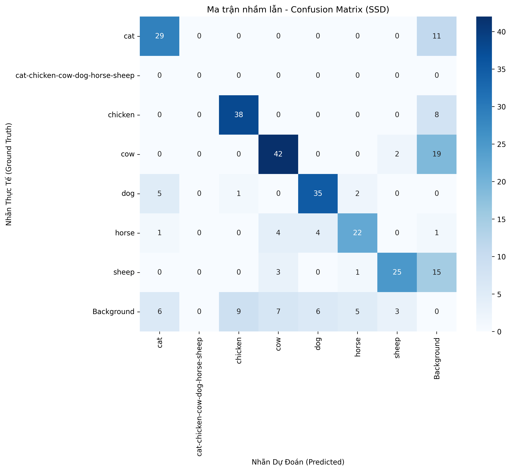
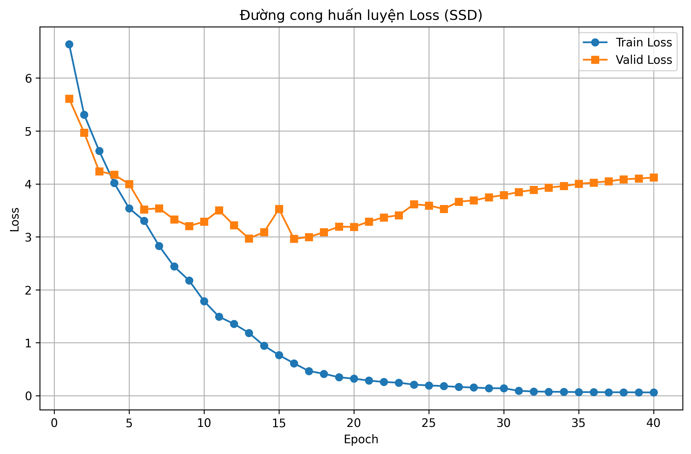

# Báo Cáo Đánh Giá Mô Hình Object Detection: Kiến Trúc SSD (Single Shot MultiBox Detector)

## 1. Giới thiệu

Báo cáo này trình bày kết quả huấn luyện, đánh giá và phân tích chi tiết về việc sử dụng kiến trúc SSD (Single Shot MultiBox Detector) với backbone VGG16 cho bài toán Object Detection. Mục tiêu là phân tích kiến trúc, điểm mạnh, điểm yếu và đánh giá độ chính xác cũng như tốc độ thực thi trên tập dữ liệu thực tế.

## 2. Cách Phân Chia Dữ Liệu

Bộ dữ liệu được sử dụng bao gồm tổng cộng 1722 hình ảnh các loài động vật được chia thành 3 phần chính (Train, Validation, Test) theo tỷ lệ 7/2/1 cụ thể như sau:

- **Tập Huấn Luyện (Train):** 1205 ảnh (chiếm 70%) dùng để huấn luyện mô hình.
- **Tập Xác Thực (Validation):** 345 ảnh (chiếm 20%) dùng để theo dõi loss, đánh giá và tránh Overfitting trong quá trình huấn luyện.
- **Tập Kiểm Thử (Test):** 172 ảnh (chiếm 10%) dùng để đánh giá độ chính xác độc lập cuối cùng của mô hình.

Nhãn dữ liệu (annotations) được chuẩn hóa theo định dạng COCO.

## 3. Kiến Trúc SSD và Phân Tích

### 3.1. Tổng quan cấu trúc

Kiến trúc SSD là một mạng dò tìm đối tượng dạng Single-Stage (Một giai đoạn). Điểm đặc trưng nhất của SSD là nó bỏ qua giai đoạn Region Proposal Process (như trong Faster R-CNN) để tiến hành phân lớp và dự đoán bounding box ngay trong một vi xử lý duy nhất ở nhiều scale (tỷ lệ) khác nhau. Quá trình hoạt động dựa trên các _Default Bounding Boxes_ (hay anchor boxes) áp vào các Feature Maps.

Trong dự án này, mô hình được triển khai là **SSD300** sử dụng backbone **VGG16**.

### 3.2. Ưu và Nhược điểm của Mạng SSD

**Ưu điểm (Pros):**

- **Tốc độ xử lý (Inference Speed):** Rất nhanh. SSD bỏ qua khâu tạo các Region Proposals rườm rà. Do đó, mô hình phù hợp với các hệ thống cần Real-time (thời gian thực). Tốc độ ghi nhận hiện tại đạt **11.23 FPS** (trên GPU) cho việc đi qua mô hình và hậu xử lý NMS.
- **Dò tìm đa tỷ lệ (Multi-scale object detection):** Bằng cách đưa ra các dự đoán từ nhiều Feature Maps ở các mức độ sâu khác nhau của backbone, SSD đặc biệt tốt trong việc bắt các đối tượng có kích thước thay đổi trong cùng một khung hình.
- **Đào tạo End-to-End:** Dễ tích hợp, code kiến trúc trực quan và tính toán Loss đồng thời cả Localization Error (Smooth L1 Loss) và Confidence Error (Cross Entropy) một cách mượt mà.

**Nhược điểm (Cons):**

- **Kém hiệu quả với các đối tượng quá nhỏ:** Do đặc tính dùng feature maps ở các layer cuối cùng (với resolution đã bị thu nhỏ đáng kể), các object nhỏ gặp khó để được match đúng vào các default boxes mặc định.
- **Thiết lập hyperparameters khá phức tạp:** Đòi hỏi phải định nghĩa một tập hợp các Aspect Ratios và Scales hợp lý để kích hoạt các Anchor boxes khớp với tỷ lệ khuôn dáng hình học của vật thể trong bộ dữ liệu.

## 4. Đánh Giá Hiệu Suất Mô Hình (Model Evaluation)

Kết quả dưới đây được tổng hợp từ tập Test độc lập (172 ảnh).

### 4.1. Các Độ Đo Định Lượng (Quantitative Metrics)

Dựa trên ngưỡng Confidence >= 0.50 và ngưỡng IoU >= 0.50:

- **Mean Precision (mP):** 57.58%
  - (Tỷ lệ dự đoán đúng trong số tất cả các dự đoán mô hình phát ra).
- **Mean Recall (mR):** 69.38%
  - (Tỷ lệ bắt được đối tượng đo với tổng số vật thể thực tế Ground Truth có trong ảnh).
- **Mean F1-Score (mF1):** 62.66%
  - (Sự kết hợp hài hòa cân bằng giữa Precision và Recall).
- **Tốc độ Inference:** 11.23 Khung hình/giây (FPS).

  

_Nhận xét:_ Recall cao hơn khá nhiều so với Precision. Điều này cho thấy mô hình bắt đối tượng khá tốt, ít bỏ sót. Tuy nhiên, Precision bị giảm phản ánh hiện tượng mô hình đang phát sinh nhiều dự đoán "False Positive" (bắt thừa hoặc bounding box lệch nhẹ quá mức IoU chuẩn).

### 4.2. Độ Phức Tạp Huấn Luyện (Training Complexity)

- Dung lượng Checkpoint: Tương đối tương đương với kích thước VGG16 kết hợp các Layer Convolution bổ sung (khá tốn sức chứa so với Yolov8Nano).
- Loss Function Converge (Hội tụ Loss): Được đánh giá khách quan thông qua biểu đồ **Loss Curve** (thu lại tại `outputs/loss_curve.png`). Train Loss hội tụ ổn định, không có hiện tượng nổ gradient.

  

## 5. Khả Năng Áp Dụng Thực Tế

- **Tính ưu việt:** Sự cân bằng tốt giữa _Tốc độ_ và _Độ chính xác_. Nhờ tốc độ xấp xỉ thời gian thực (real-time) và độ chính xác ổn định, SSD300 phù hợp cho các thiết bị Camera giám sát đường phố, đếm vật thể trên băng chuyền hoặc cảnh báo an ninh gia đình, nơi tài nguyên tối đa ở mức Edge devices (như Jetson Nano).
- **Điều kiện ứng dụng:** Do yếu điểm đối với hạt/vật nhỏ, mô hình không phù hợp cho chụp X-quang Y tế hoặc phát hiện các chi tiết li ti trên bo mạch điện tử, nhưng hoạt động rực rỡ đối với các đối tượng kích thước Trung bình đến Lớn, như Phân loại Động Vật qua Camera (Tương ứng với bài toán của chúng ta).

---

_Báo cáo kết thúc._
